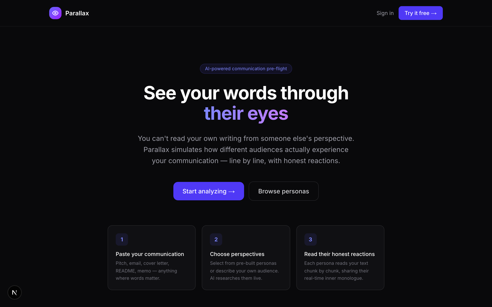
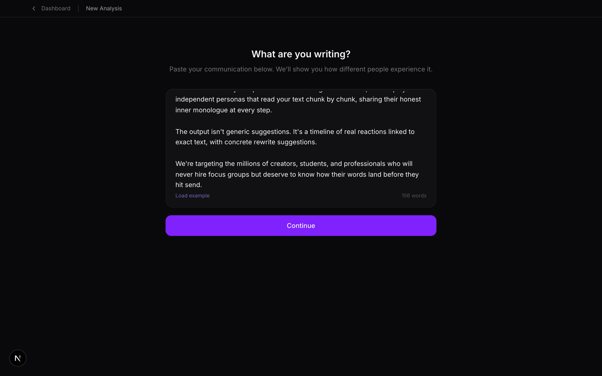
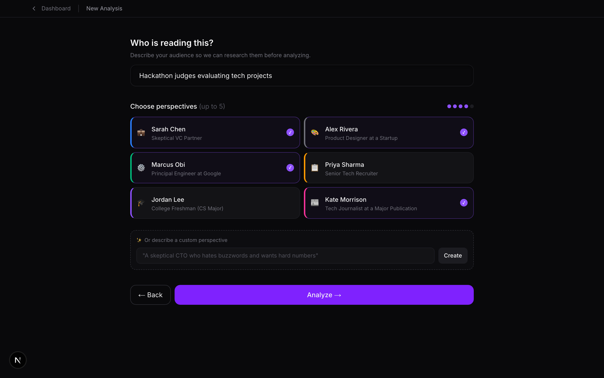
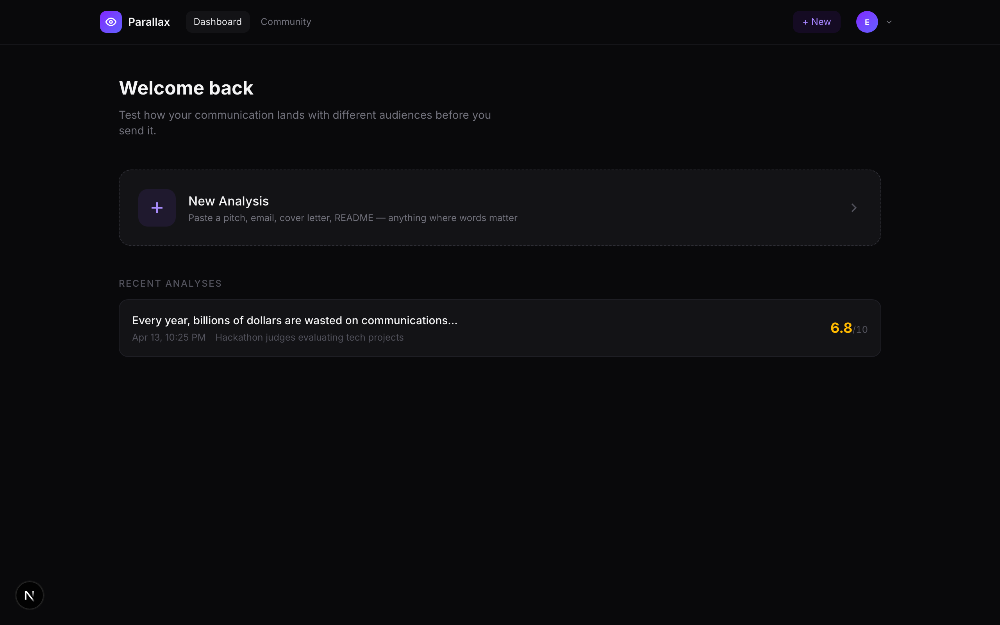
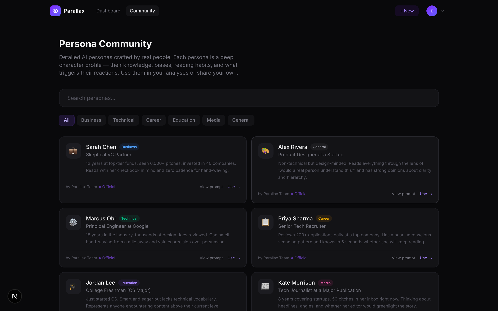

# Parallax

> See your words through their eyes.

[](https://parallax-ai.vercel.app)
[](https://techbuilders.devpost.com/)
[](#architecture)

AI-powered communication pre-flight. Paste any pitch, email, cover letter, or README — independent AI personas read your text chunk by chunk, sharing honest reactions, objections, and rewrite suggestions before you hit send.

**Evan Johan Tobias** | IIT Delhi — Abu Dhabi

---

## Demo

**Live app:** [parallax-ai.vercel.app](https://parallax-ai.vercel.app)



### The Flow

| Step | Screenshot |
|------|-----------|
| **Write** — paste your communication |  |
| **Choose perspectives** — pick personas + describe audience |  |
| **Dashboard** — track all your analyses |  |
| **Community** — browse and share persona prompts |  |

---

## The Problem

You can't read your own writing through someone else's eyes. Founders pitch investors with jargon that means nothing to a non-technical partner. Cover letters get rejected in 6 seconds. Product launches confuse more customers than they convert.

Current solutions either coach your **delivery** (Yoodli, Orai) or test **marketing copy** with expensive human panels (Wynter — $800/mo). Nothing lets you instantly see how different audiences react to the **content itself**.

## How It Works

1. **Paste** any communication
2. **Describe** your audience — AI researches them using live Google Search
3. **Select personas** — each reads your text independently, chunk by chunk, with memory
4. **Read their reactions** — a timeline of honest inner monologue with severity ratings and concrete rewrites

---

## Architecture

```
User → Next.js App Router (Vercel)
         ├── /api/research  → Gemini 2.5 Flash + Google Search Grounding
         ├── /api/analyze   → Parallel persona execution (Promise.all)
         └── /api/persona   → Custom persona generation
                                    ↕
                              Supabase (Auth + PostgreSQL + RLS)
```

### Key Decisions

- **Chunk-based reading with memory** — text split into paragraphs, personas read sequentially carrying forward impressions. First impressions color everything after.
- **Parallel independent execution** — each persona is a separate API call. No cross-contamination between perspectives.
- **Grounded research** — Gemini searches the live web before analysis. Feedback reflects current audience priorities, not just training data.
- **Fallback chain** — grounded → standard → lite model. Degrades gracefully, never crashes.
- **Deep persona prompts** — 500+ words each, covering reading patterns, biases, pet peeves, and memory behavior.

### Stack

| Layer | Technology |
|-------|-----------|
| Framework | Next.js 16 (App Router, TypeScript) |
| Styling | Tailwind CSS 4 |
| AI | Gemini 2.5 Flash + Google Search Grounding |
| Auth + DB | Supabase (PostgreSQL, Row Level Security) |
| Hosting | Vercel |

---

## Personas

Six deeply crafted defaults — each with a 500+ word behavioral profile:

| Persona | Role | What Makes Them Distinct |
|---------|------|------------------------|
| Sarah Chen | Skeptical VC Partner | Eyes jump to numbers first. "Revolutionary" = instant skepticism. Running credibility score. |
| Alex Rivera | Product Designer | Evaluates structure before content. >30 word sentences = resentment. Thinks in hierarchy. |
| Marcus Obi | Principal Engineer | "AI-powered" without specs = hand-waving. Jumps to architecture. Precision over persuasion. |
| Priya Sharma | Senior Tech Recruiter | 6-second fixed-pattern scan. No quantified impact = skip. |
| Jordan Lee | College Freshman | Reads every word. Confusion compounds on shaky foundation. Gets embarrassed about not understanding. |
| Kate Morrison | Tech Journalist | First paragraph sets everything. "Revolutionary" = "this person emailed 200 journalists." |

Create **custom personas** from any text description.

---

## Running Locally

```bash
git clone https://github.com/EchoRover/parallax.git
cd parallax
npm install
```

Create `.env.local`:
```
GEMINI_API_KEY=your_key
NEXT_PUBLIC_SUPABASE_URL=your_url
NEXT_PUBLIC_SUPABASE_ANON_KEY=your_key
```

```bash
npm run dev
```

---

## Documentation

A detailed technical report is available: [`report.tex`](report.tex)

Covers: problem statement, architecture decisions, persona engineering methodology, chunk-based reading design, data model, challenges, and practical relevance.

---

## License

MIT
